## Introduction
As we have seen in the
previous episode - even a simple software project is typically split into smaller functional units and modules which are kept in separate files and subdirectories.
As your code starts to grow and becomes more complex, it will involve many different files and various external libraries. You will need an application to help you manage all the complexities of, and provide you with some useful (visual)
facilities for, the software development process. Such clever and useful graphical
software development applications are called Integrated Development Environments (IDEs).

## Integrated Development Environments (IDEs)
An IDE normally consists of at least a source code editor, build automation tools and a debugger.
The boundaries between modern IDEs and other aspects of the broader software development process are often blurred as
nowadays IDEs also offer version control support, tools to construct graphical user interfaces (GUI) and web browser
integration for web app development, source code inspection for dependencies and many other useful functionalities. The
following is a list of the most commonly seen IDE features:

- syntax highlighting - to show the language constructs, keywords and the syntax errors with visually distinct colours
and font effects
- code completion - to speed up programming by offering a set of possible (syntactically correct) code options
- code search - finding package, class, function and variable declarations, their usages and referencing
- version control support - to interact with source code repositories
- debugging - for setting breakpoints in the code editor, step-by-step execution of code and inspection of variables

IDEs are extremely useful and modern software development would be very hard without them. There are a number of IDEs
available for Python development; a good overview is available from the
[Python Project Wiki](https://wiki.python.org/moin/IntegratedDevelopmentEnvironments). In addition to IDEs,
there are also a number of code editors that have
Python support. Code editors can be as simple as a text editor with syntax highlighting and code formatting capabilities
(e.g. GNU EMACS, Vi/Vim, Atom). Most good code editors can also execute code and control a
debugger, and some can also interact with a version control system. Compared to an IDE, a good dedicated code
editor is usually smaller and quicker, but often less feature-rich. You will have to decide which one is the best for
you - in this course we will learn how to use [VS Code](https://code.visualstudio.com/), a free code editor from Microsoft. Some popular alternatives include free and open source IDE [Spyder](https://www.spyder-ide.org/) and [PyCharm](https://www.jetbrains.com/pycharm/), a free open source Python IDE.

## Using Visual Source Code

Let's open our project in VS Code now and familiarise ourselves with some commonly used features.

### Opening a Software Project
If you don't have VS Code running yet, start it up now. If this is the very first time that you are running VS Code you should be presented with a windows such as in the image below.

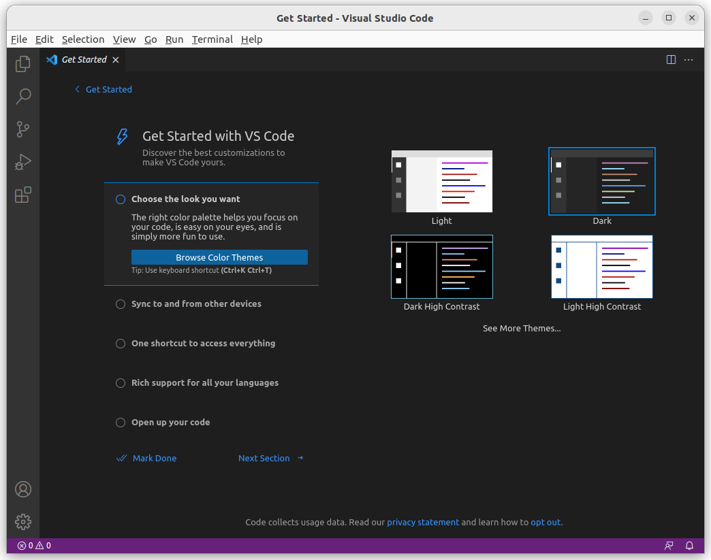

On this screen you can select the theme that you would like. There are two light themes, i.e. dark text on a light background and two dark themes, i.e. light text on a dark background. Select the theme that you think would give you the best environment to work in. When you have made your selection, click on `Next Section` at the bottom of the screen.

At this point, we can ignore the next screen which allows you to configure your editing environment. Just click `Next Section` at the bottom of the screen.

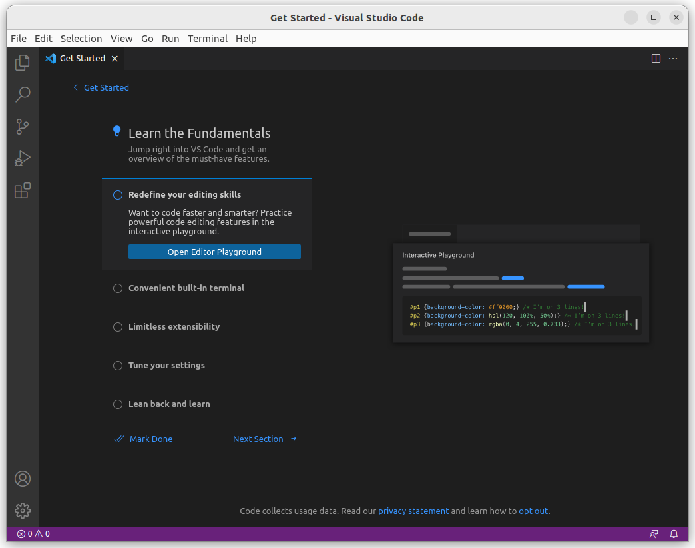

On the next screen you would want to select `Side by side editing` and `Install Git`. Leave `Customize your shortcuts` unticked for now. When done, click `Mark Done`.

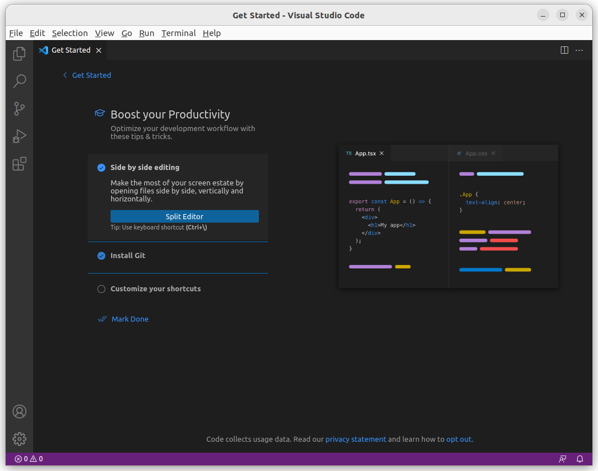

Select `Open Folder` to find the software project directory `python-intermediate-inflammation` you cloned earlier. 

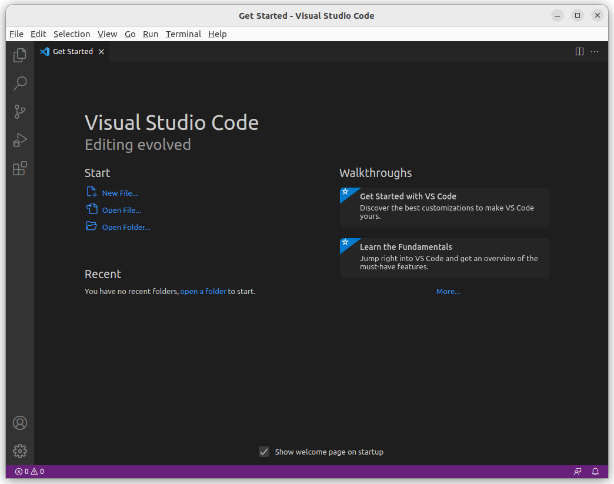

A window will pop up asking whether you trust the authors of the files in the folder. You can click the button that says: "Yes, I trust the authors. Trust folder and enable all features." You could also tick the box above to "Trust the authors of all files in the parent folder".

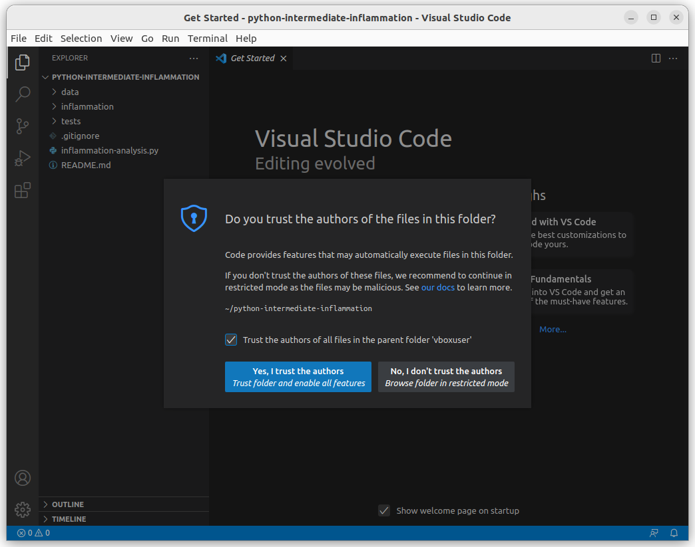

This directory is now the current working directory for VS Code, so when we run scripts from VS Code,
this is the directory they will run from.

You will notice the editor showing you a list of icons on the left hand side, just below the VS Code logo. This area is called the `Activity Bar`. From top to bottom these are:
- Explorer
- Search
- Source Control
- Run and Debug
- Extensions

If you hover over these icons with your mouse a tooltip should pop up showing you what each icon is for. You should also now see the file explorer opened on the left hand side, the `Side Bar`, showing you a tree view of the files in the selected folder. The explorer icon will also be highlighted, while the others are greyed:

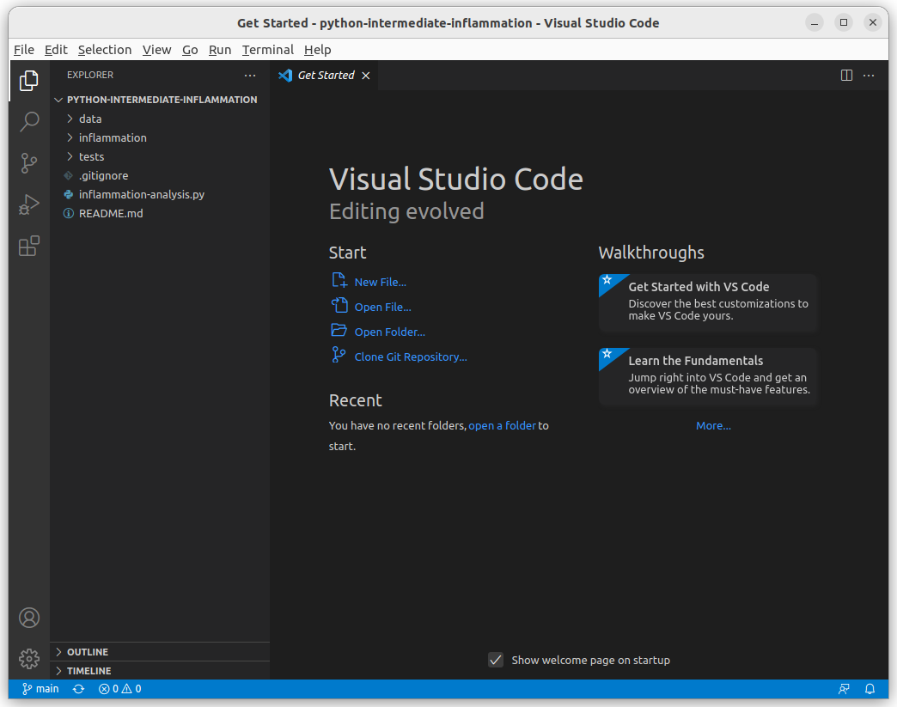

Select the `inflammation-analysis.py` file in the 'Side Bar'. The file will open in the editor window, but at the bottom of the screen you will see a notification with the question, `Do you want to install the recommended extentions for Python?` Click the `Install` button.

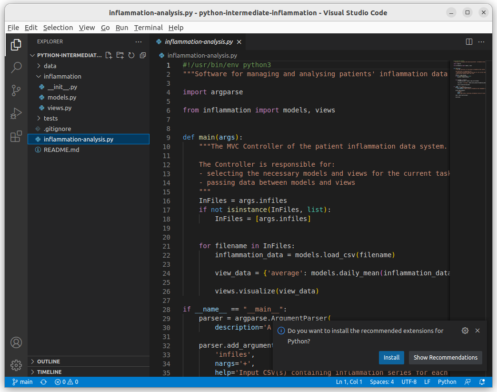

On the next window you will be able to install the Python extension. Click the install button.

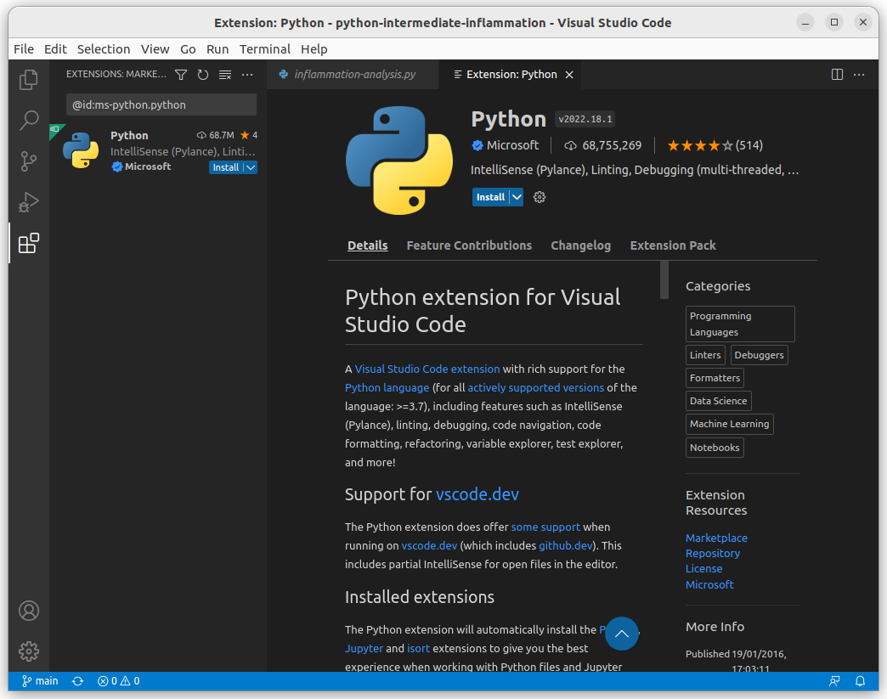

After the installation more tabs might have opened next to the inflammation-analysis.py tab. You can close those tabs by clicking on the X in the tab next to the tab name, but leave the inflammation-analysis.py tab obpen. You might also have noticed in the `Side Bar` the `Explorer` has been replaced by `Extensions` and the extension icon in the `Activity Bar` is now hightlighted, while the others are greyed. 

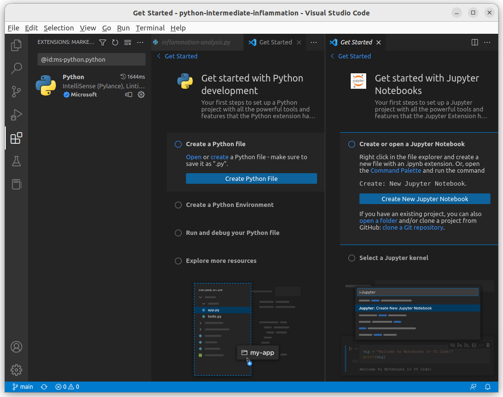

### Configuring the Terminal
VS Code has a built-in terminal which you can open, as sometimes you might want to execute commands directly in the terminal. By default VS Code, in Windows, will open the PowerShell which has restricted access. You can see what this looks like by clicking `Terminal` on the menu and then selecting `New Terminal`. The new terminal should open at the bottom of the screen. If you still have the `inflammation-analysis.py` file open, you might see error message displayed as in the screenshot below:

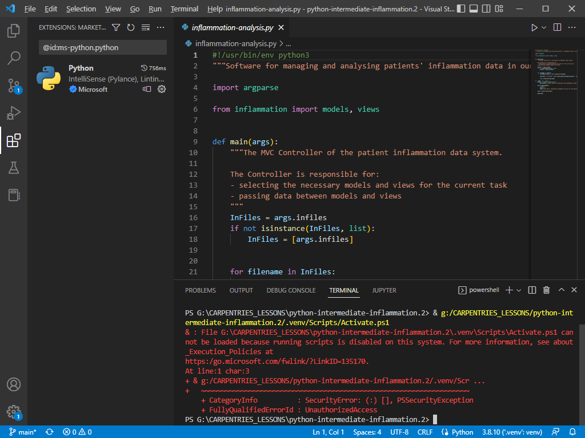

To change the default terminal, look at the top of the terminal section. There should be a `> powershell` button. Click on the `v` arrow to the right of the `> powershell` button and select `Git Bash`.

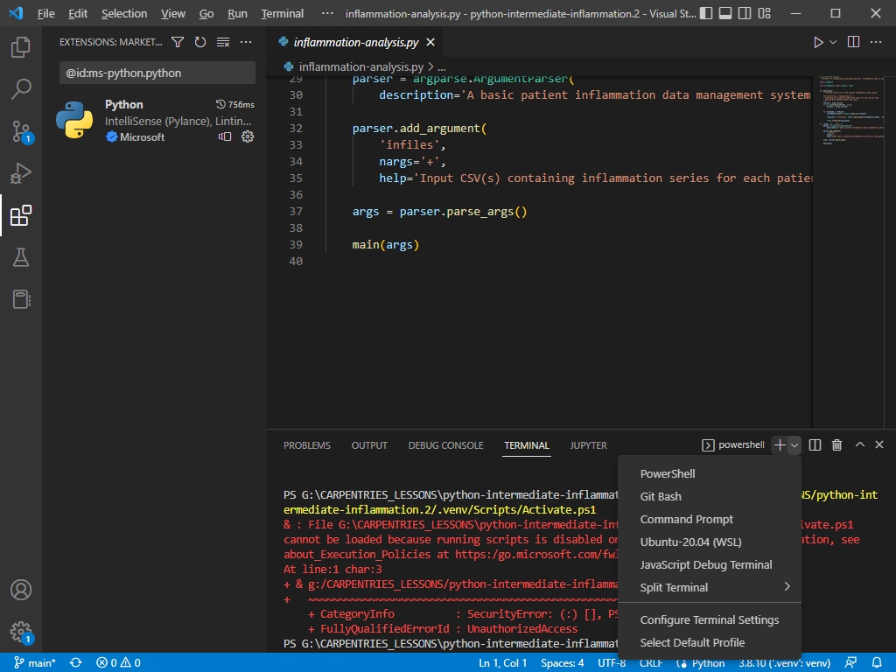

A `Git Bash` shell should have opened. You should see (.venv) displayed in the shell which means the virtual environment has been detected. There should be no error messages. To the right hand side of the terminal you should notice a section displaying two shells - the powershell that we had open before and below that `bash` which is our current `Git Bash` shell. 

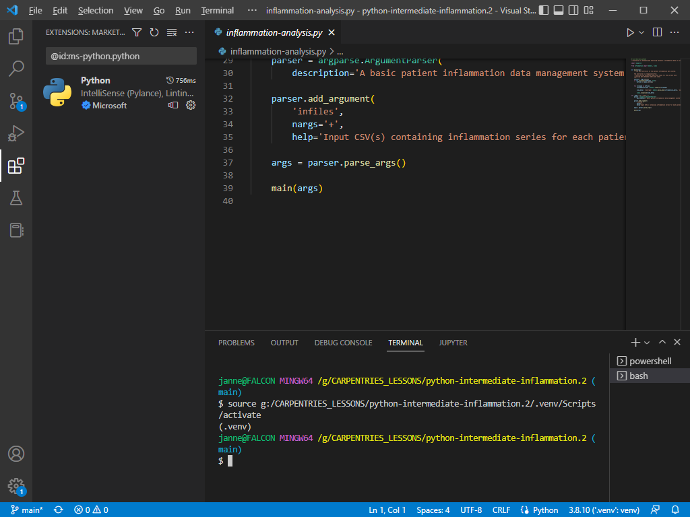

You can close the powershell by hovering over the button with the mouse at which time a garbage bin should appear next to it. Click on the garbage bin to close the terminal. The `bash` shell should remain open.

### Configuring a Virtual Environment in VS Code
Because we created the `venv` environment before we opened the project in VS Code, VS Code and the Python extension were able to detect the environment. We could see that this was the case when we opened the terminal and saw `(.venv)` displayed before the prompt.

If we didn't create the virtual environment beforehand we can do after we opened the project folder in VS Code. To create such a virtual environment you have to click `Ctrl+Shift+P`. In the search box, start typing 'Python: Create Environment'. You won't have to completely type the string before you'll notice it in the list. Click on `Python: Create Environment`. Then select `Venv Creates a '.venv' virtual environment in the the current workspace`.

You should now get a list of installed Python interpreters. You should select the one that is required for your project. A `.venv` directory will now be created. You should be able to se this happen in the explorer tab.

#### Adding an External Library
We have already added packages `numpy` and `matplotlib` to our virtual environment from the command line
in the previous episode, so we are up-to-date with all external libraries we require at the moment. However, we will need library `pytest` soon to implement tests for our code so will use this 
opportunity to install it from VS Code. Strictly speaking VS Code is not an IDE but a code editor which is why we still need to do things in the terminal. An IDE such as PyCharm will have alternative ways to do this via the Graphic User Interface.

1. If you already have an open terminal at the bottom of the screen you can enter the following commands in there. If you don't have a terminal open you can open one by clicking on the `Terminal` menu item and then selecting `New Terminal`.
2. Double check that your virtual environment is active by looking for `(.venv)` displayed with your prompt.
3. As before we will use pip3 to install the library. In the terminal type: `pip3 install pytest`. It might take a few minutes to install.

Pytest should now be installed. You can also verify this from the command line by listing the `venv/lib/python3.9/site-packages` subdirectory. Note, however, that `requirements.txt` is not updated - as we mentioned earlier this is something you have to do manually. Let's do this as an exercise.

>## Exercise: Update `requirements.txt` After Adding a New Dependency
Export the newly updated virtual environment into `requirements.txt` file.
>>## Solution
>>Let's verify first that the newly installed library `pytest` is appearing in our virtual environment
>>but not in `requirements.txt`. First, let's check the list of installed packages:
>> ~~~
>> (venv) $ pip3 list
>> ~~~
>> {: .language-bash}
>> ~~~
Package         Version
--------------- -------
attrs           21.4.0 
cycler          0.11.0 
fonttools       4.28.5 
iniconfig       1.1.1  
kiwisolver      1.3.2  
matplotlib      3.5.1  
numpy           1.22.0 
packaging       21.3   
Pillow          9.0.0  
pip             20.0.2 
pluggy          1.0.0  
py              1.11.0 
pyparsing       3.0.7  
pytest          6.2.5  
python-dateutil 2.8.2  
setuptools      44.0.0 
six             1.16.0 
toml            0.10.2 
tomli           2.0.0  
>> ~~~
>> {: .output}
>> We can see the `pytest` library appearing in the listing above. However, if we do:
>>~~~
>>(venv) $ cat requirements.txt
>>~~~
>>{: .language-bash}
>>~~~
cycler==0.11.0
fonttools==4.28.1
kiwisolver==1.3.2
matplotlib==3.5.0
numpy==1.21.4
packaging==21.2
Pillow==8.4.0
pyparsing==2.4.7
python-dateutil==2.8.2
setuptools-scm==6.3.2
six==1.16.0
tomli==1.2.2
>>~~~
>>{: .output}
>> `pytest` is missing from `requirements.txt`. To add it, we need to update the file by repeating the command:
>>~~~
>>(venv) $ pip3 freeze > requirements.txt
>>~~~
>>{: .language-bash}   
>> `pytest` is now present in `requirements.txt`:
>>~~~
attrs==21.2.0
cycler==0.11.0
fonttools==4.28.1
iniconfig==1.1.1
kiwisolver==1.3.2
matplotlib==3.5.0
numpy==1.21.4
packaging==21.2
Pillow==8.4.0
pluggy==1.0.0
py==1.11.0
pyparsing==2.4.7
pytest==6.2.5
python-dateutil==2.8.2
setuptools-scm==6.3.2
six==1.16.0
toml==0.10.2
tomli==1.2.2
>>~~~
>{: .solution}
{: .challenge}

### Syntax Highlighting
The first thing you may notice is that code is displayed using different colours.
Syntax highlighting is a feature that displays source code terms in different colours and fonts according to the syntax
category the highlighted term belongs to. It also makes syntax errors visually distinct. Highlighting does not affect
the meaning of the code itself - it's intended only for humans to make reading code and finding errors easier.

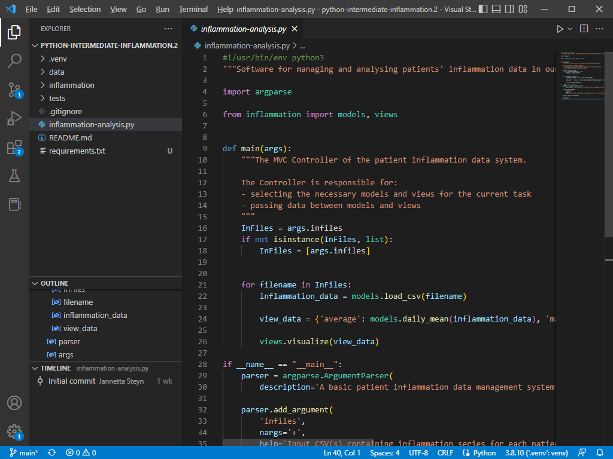{: .image-with-shadow width="1000px" }

### Code Completion
As you start typing code, VS Code will offer to complete some of the code for you in the form of an auto completion popup.
This is a context-aware code completion feature that speeds up the process of coding (e.g. reducing typos and other
common mistakes) by offering available variable
names, functions from available packages, parameters of functions, hints related to syntax errors, etc.

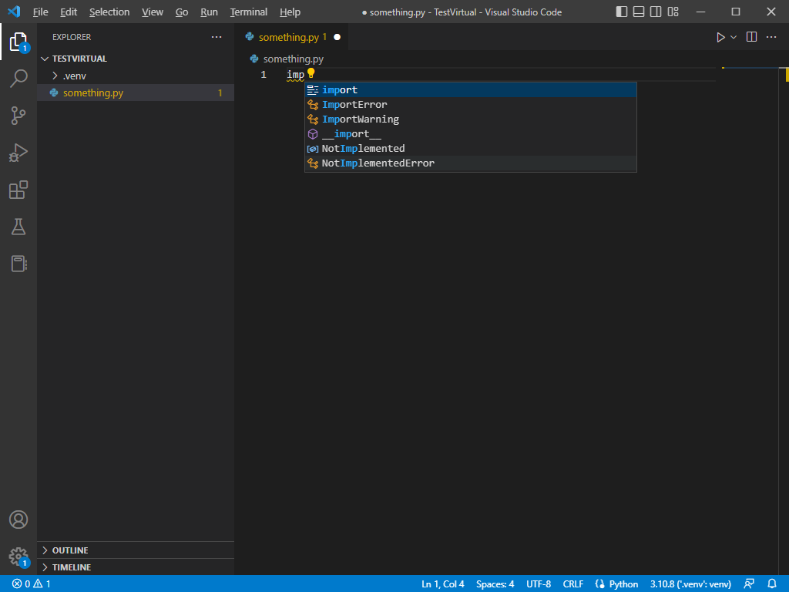{: .image-with-shadow width="600px" }

### Code Definition & Documentation References
You will often need code reference information to help you code. VS Code shows this useful information, such as definitions of symbols (e.g. functions, parameters, classes, fields, and methods) and documentation references by means of quick popups and inline tooltips.

For a selected piece of code, you can access various code reference information by right clicking for a menu which will offer amongst other things:
- Go to Definition
- Go to Definition
- Go to Type Definition

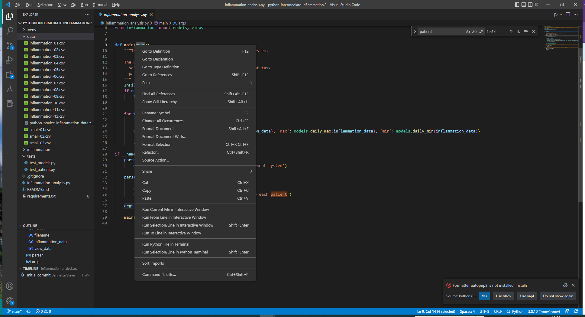{: .image-with-shadow width="1000px" }

### Code Search
#### In the current file
You can search for a string in your current file. The easiest is to press Ctrl+F. In the top right hand corner of the edit screen there should be a popup box with a search field.
2. If you have anything selected it will automatically be added to the search field. You can delete that if you want, replace it, extend it or use it as is.
3. Next to the search string there are three options: `Aa ab .*`. `Aa` is to match the case of the search string, `ab` is to match complete words and `.*` is for using regular expressions. When you click any of these options, they will be highlighted, meaning that it will be used when searching. Click an option again to disable it.

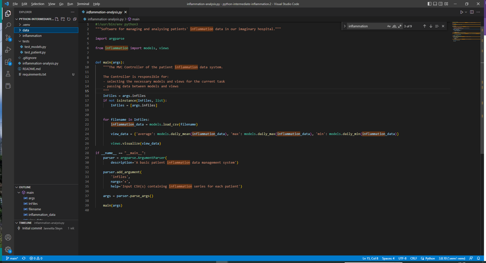{: .image-with-shadow width="1000px" }

#### In the whole project
You can search for a text string within a project, use different scopes to narrow your search process, and use regular expressions
for complex searches. To find a search string
in the whole project:

1. From the main menu, select `Edit | Find in Files`. Just below the Edit menu at the top of the side bar, a search field should appear.
2. If you have anything selected it will automatically be added to the search field. You can delete that if you want, replace it, extend it or use it as is.
3. As before the three search options are available for selection.

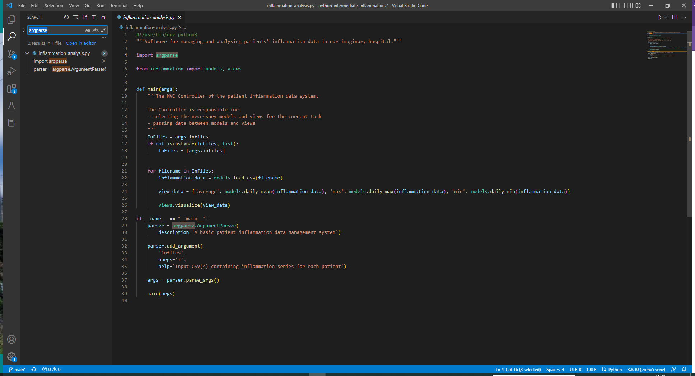{: .image-with-shadow width="1000px" }

### Version Control

VS Code allows you to do version control from within the editor, i.e. you don't have to use the terminal. Our project was already under Git version control and VS Code recognised it. If a project is not yet under version control you can do so by navigating to Source Control using the button on the Activity Bar.

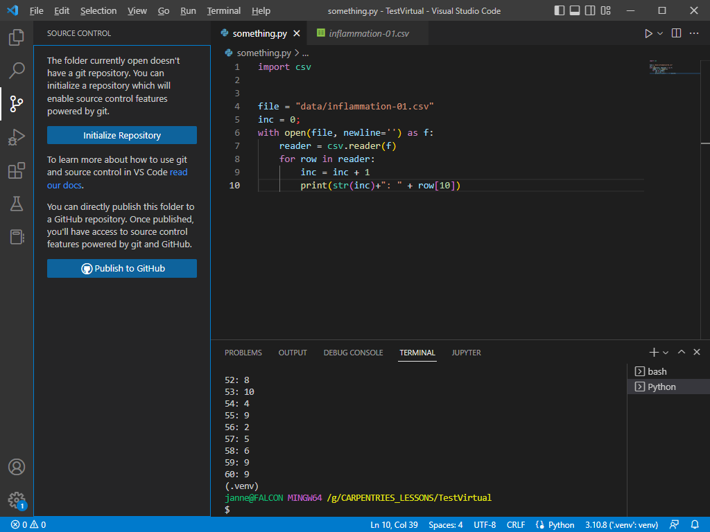{: .image-with-shadow width="1000px" }

During this course, we will do all our version control commands from the command line but it is worth
noting that it can be done from within VS Code.

### Running Scripts in PyCharm
We have configured our environment and explored some of the most commonly used VS Code features and are now ready to run our script from VS Code! To do so, right-click the `inflammation-analysis.py` file in the Explorer in the Activity Bar and then select `Run Python File in Terminal`. 

{: .image-with-shadow width="800px" }

The script will run in a terminal window at the bottom of the IDE window and display something like:

~~~
/Users/alex/work/python-intermediate-inflammation/venv/bin/python /Users/alex/work/python-intermediate-inflammation/inflammation-analysis.py
usage: inflammation-analysis.py [-h] infiles [infiles ...]
inflammation-analysis.py: error: the following arguments are required: infiles

Process finished with exit code 2
~~~
{: .output}

This is the same error we got when running the script from the command line. We will get back to this error
shortly - for now, the good thing is that we managed to set up our project for development both from the
command line and PyCharm and are getting the same outputs.
Before we move on to fixing errors and writing more code, let's have a look at the last set of tools for collaborative
code development which we will be using in this course - Git and GitHub.



