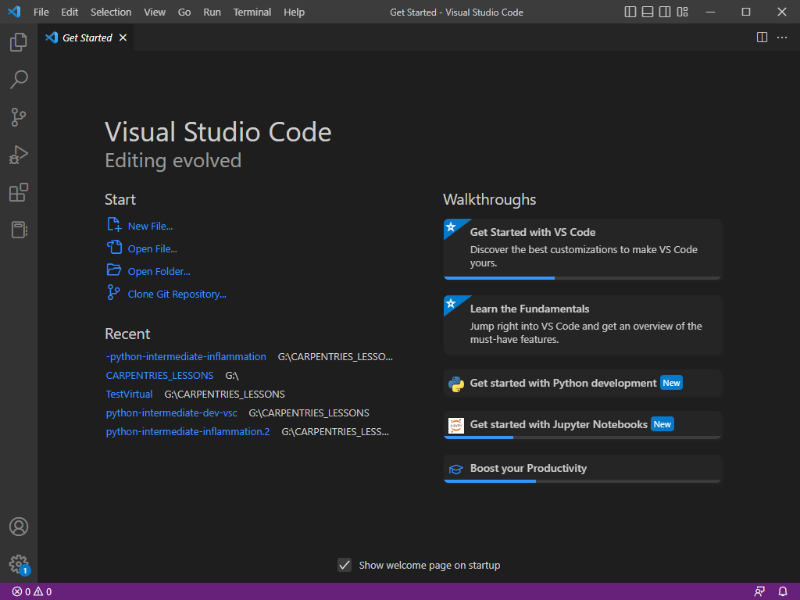
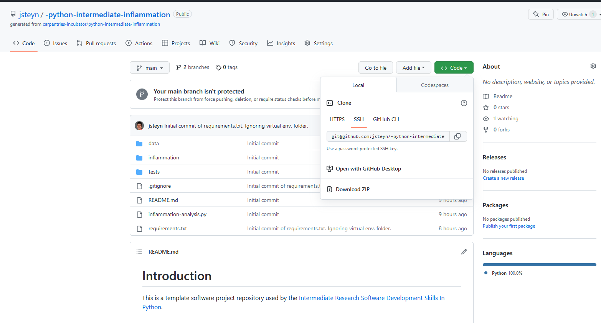
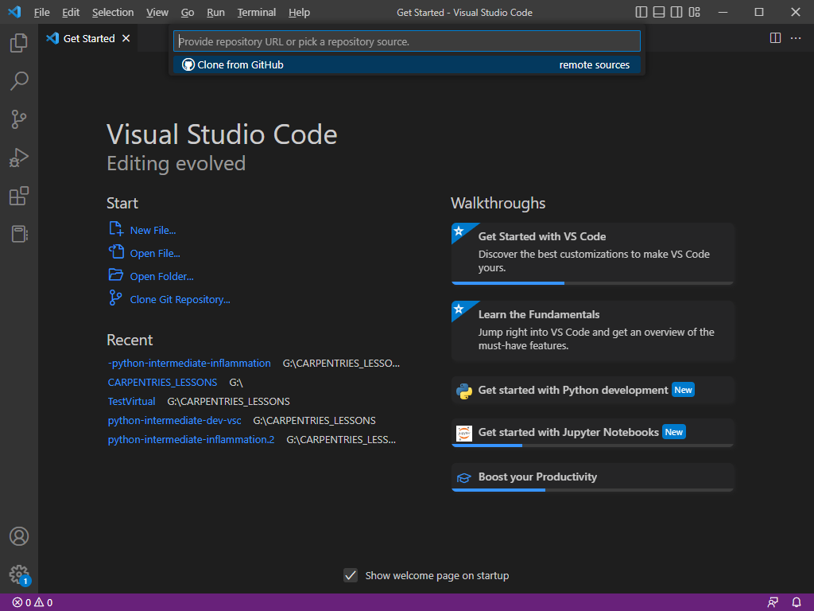
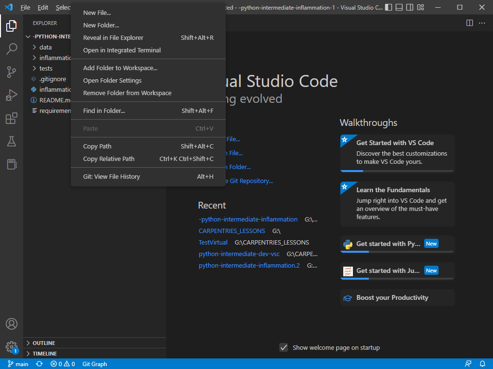
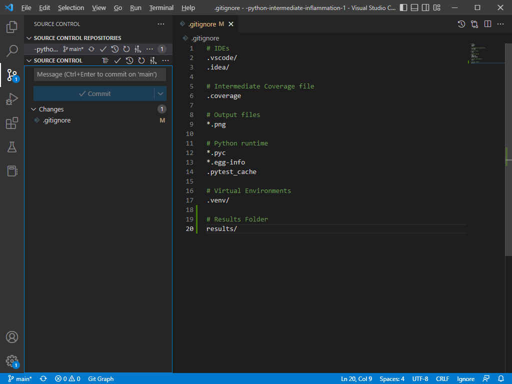

## Introduction
In the previous episode we refreshed our memory on how to do Git things from the command line. However, it is possible to do 
te same things from within VS Code by just clicking a button.

## Cloning
Let's start by cloning the project we have been working on again. Remember that this will create a second copy of the project 
on your hard drive. For this reason we have to give it a different name.

Start by opening a new VS Code window. Click on the `File` menu item and then on `New Window`.

{: .image-with-shadow width="1000px"}

Navigate to your GitHub repository in your browser and click on the green 'Copy' button. Make sure the SSH tab is selected 
and copy the URL, which should start with `git@github` in the text area. You can copy the URL by clicking the little copy 
icon just to the right of the text area.

{: .image-with-shadow width="1000px"}

Back in VS Code's new window, in the editor are, you should see an option 'Clone Git Repository.

{: .image-with-shadow width="1000px"}

In the text area at the top you can now enter the URL of the git repository. Click on `Clone from URL`. You now have to select a 
directory for the repository to be cloned. You can create it in the same main directory in which you clone the first instance 
of the repository but we will give it a new name so that it doesn't clash in any way. Make sure you don't create it within the previous 
repository, you just want it on the same hierachical level. VS Code will notice that a repository with the name `python-intermediate-inflammation`
already exists and it will clone this new instance with the name `python-intermediate-inflammation-1`. VS Code will also ask you whether
you want to open the new folder. You can click `Yes` to this question and the project will be openend for you.

The changes you made in the previous lesson were pushed to the GitHub repository so those changes will be in this
new instance of the lesson material. 

Let's repeat a few of the git actions we did before, this time not from the command line but with VS Code features.

### Creating a virtual environment

1. Press Ctrl+Shift+P
2. Find and click `Python: Create Environment`
3. Click `Venv`
4. Select Python interpreter (3.9.# if possible)

### Creating a new folder

Right click in the side bar and select `New Folder`. Call the new folder `results`. 

{: .image-with-shadow width="1000px"}

Usually we don't want results added to
version control so add `results/` to the .gitignore file. See if you can do this by yourself.

> ## Exercise: Add the `results` folder to .gitignore
> Open the .gitignore file and add `results/`
> > ## Solution
1. Click on .gitignore in the Side Bar, to open the file in the editor area.
2. Add the following text at the bottom of the file:
> > ```
> > # Results Folder
> > results
> > ```
3. Press Ctrl+S to save the file
> {: .solution}
{: .challenge}

### Making sense of the VS Code window

You might notice that the moment you save the file, a small blue circle with a `1` in it appears over the Source Control 
button in the Activity Bar. From this we can see that there is one untracked change. Click on the Source Control button. 
Take a moment to study the source control items in the Side Bar.

{: .image-with-shadow width="1000px"}

1. Below the heading `SOURCE CONTROL REPOSITORIES` we can see the name of our repository, `python-intermediate-inflammation-1`
2. Below the second heading, `SOURCE CONTROL`, there is a text area.
3. There is a `Commit` button that is inactive
4. Then you should see the title `Changes` and to the right of it a `1` in a circle
5. You should see `.gitignore` and to the right of it an `M`
6. In the bottom left hand corner of the screen you should see the source control icon and next to it the word `main`

From this information we can tell that:

1. we are working on the `python-intermediate-inflammation-1`
2. One file (indicated by the `1` next to the `Changes` heading), `.gitignore`, had been modified (hence the `M` next to it), 
but the change has not been staged
3. The word `main` in the bottom left hand corner of the screen tells us that we are on the main branch

### Commit and Push

Remember the order of getting things into the repository?
1. Stage the file/s by adding it
2. Commit the file with a message
3. Push the file to GitHub

To do this from VS Code, first hover over the .gitignore file in the Side Bar. You'll notice three more icons to the left of the `M`. The first icon is for opening the file, the second for reverting all changes and the third, the `+` is for staging the file. Click the `+`. The heading that used to say `Changes`, now changed to `Staged Changes`. The `Commit` button is now active. Enter the commit message, `Ignore results folder`, in the text area above the `Commit` button and then click the `Commit` button. Next to the repository name there should be a button with three dots, `...`. Click the button and then click `Push` on the pop-up menu.



